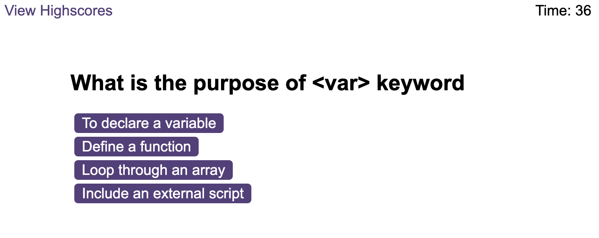

# Code Quiz
## Description
This is a simple quiz app that allows you to test you knowledge on JavaScript. Whether you are a student or simply curious about JavaScript. You will Learn and improve with this code quiz app.

## Installation
Open link at https://pamam31.github.io/codequiz/

## Usage
Click on the link to access app. Click on the start button to start the quiz and start building your knowledge.

If an answer is wrong, the timer will deduct 5 seconds. If you get a correct answer, you will be given a point.
At the end of the quiz, you can enter your initials to save your highscore.

## Credits
N/A

## License
MIT License. Please refer to license in the repo.
